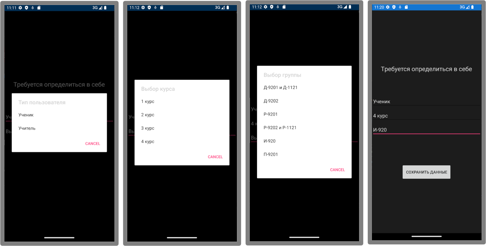

# 📅 College Schedule Mobile App


Мобильное приложение для удобного просмотра расписания образовательного учреждения.

Приложение получает данные из **Google Sheets**, используя **Google Apps Script API**, обрабатывает таблицу расписания и показывает пользователю только нужную информацию в удобном интерфейсе.

---

# 📱 Preview

### UI


### Identification


---

# 🚀 Features

- 📅 Автоматическая загрузка расписания
- ⚡ Обработка и фильтрация таблицы
- 👤 Идентификация пользователя
- 💾 Кэширование данных в SQLite
- 🔄 Обновление расписания через API
- 📱 Удобный мобильный интерфейс

---

# 🔄 Data Flow

```
Google Sheets
     │
     ▼
Google Apps Script (API)
     │
     ▼
Mobile Application
     │
     ├─ Fetch Data
     ├─ Parse Schedule
     ├─ Save to SQLite
     └─ Render UI
```

---

# 🗄 Data Source

Исходные данные хранятся в **Google Sheets**.

Таблица содержит расписание всех групп и курсов, которое:

- загружается через API
- фильтруется по пользователю
- сохраняется локально

---

# 🧩 Tech Stack

**Mobile Application**

- Xamarin.Forms
- C#

**Backend API**

- Google Apps Script

**Database**

- SQLite

**Data Source**

- Google Sheets

---

# 🎯 Purpose

Проект создан для:

- удобного просмотра расписания колледжа
- демонстрации мобильного приложения с внешним источником данных
- практики работы с Google Apps Script API